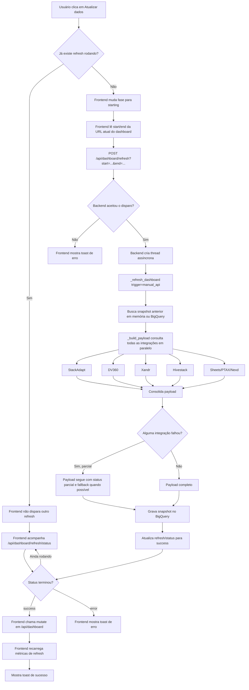

# Fluxo do Botão Atualizar Dados

Este documento descreve o que acontece quando o usuário clica em `Atualizar dados` no frontend do Cost Dashboard.

## Visão Geral

O clique não espera todas as integrações terminarem no próprio request do navegador. O frontend apenas dispara um refresh assíncrono no backend e passa a acompanhar o status do run.



## Passo a Passo

1. O usuário clica em `Atualizar dados`.
2. O frontend verifica se já existe refresh em andamento (`isRefreshRunning`).
3. Se já houver refresh rodando, o clique é ignorado e a UI continua acompanhando o status atual.
4. Se não houver refresh rodando, o frontend entra na fase `starting`.
5. O frontend pega `start` e `end` da URL atual do dashboard.
6. O frontend envia `POST /api/dashboard/refresh`.
7. O backend dispara um refresh assíncrono com trigger `manual_api`.
8. O endpoint responde rápido; o navegador não fica preso esperando DV360, StackAdapt, Xandr etc.
9. O frontend consulta `/api/dashboard/refresh/status` a cada 2 segundos enquanto o refresh está em andamento.
10. O botão fica desabilitado e a UI mostra o tempo decorrido.
11. Quando o backend termina com `success`, o frontend recarrega `/api/dashboard`.
12. O frontend também recarrega `/api/dashboard/refresh/metrics`.
13. Se o backend terminar com `error`, o frontend mostra toast de erro e mantém os dados anteriores.

## O Que o Refresh Manual Atualiza

O refresh manual usa trigger `manual_api`, então ele consulta todas as plataformas:

| Fonte | Atualiza no clique manual? | Observação |
| --- | --- | --- |
| StackAdapt | Sim | Timeout geral de integração rápida. |
| DV360 | Sim | Timeout dedicado, pois depende de relatório assíncrono do Google. |
| Xandr | Sim | Timeout geral de integração rápida. |
| Hivestack | Sim | Timeout geral de integração rápida. |
| Sheets / Campaign Journey | Sim | Usado para cruzar tokens, campanhas, clientes e vigência. |
| PTAX | Sim | Usado para conversão USD/BRL quando necessário. |
| Nexd | Sim | Atualiza impressões e custo estimado. |

## Estados no Frontend

| Estado | Significado |
| --- | --- |
| `idle` | Nenhum refresh manual em andamento. |
| `starting` | O frontend disparou o `POST`, mas ainda está confirmando o run no backend. |
| `running` | O backend confirmou que há um run em andamento. |

Se o frontend ficar em `starting` por mais de 30 segundos sem conseguir confirmar o início, ele mostra erro: `Não foi possível confirmar início da atualização.`

## Endpoints Envolvidos

| Endpoint | Método | Função |
| --- | --- | --- |
| `/api/dashboard/refresh` | `POST` | Dispara refresh assíncrono do período selecionado. |
| `/api/dashboard/refresh/status` | `GET` | Informa se há run rodando, qual trigger, run ID e status final. |
| `/api/dashboard/refresh/metrics` | `GET` | Retorna métricas históricas de refresh manual. |
| `/api/dashboard` | `GET` | Retorna o dashboard atualizado depois que o run termina. |

## Falhas e Fallbacks

- Se uma integração rápida passa do timeout, ela entra em `platform_results` com `status=error`.
- Se a DV360 passa do timeout durante refresh manual ou `scheduled_dv360`, ela entra em `platform_results` com `status=error` e o alerta continua visível.
- O backend só reaproveita snapshot anterior para plataformas que não foram consultadas naquele ciclo, como DV360 durante `scheduled_fast`.
- Se o refresh termina com erro total, o frontend não substitui o dashboard atual por dados incompletos.
- Alertas no Discord podem ser enviados quando o backend identifica falha parcial ou falha total, conforme configuração do webhook.

### Timeouts da DV360

A DV360 tem dois timeouts configuráveis:

| Variável | Função |
| --- | --- |
| `DV360_REPORT_POLL_TIMEOUT_SECONDS` | Tempo máximo esperando o relatório assíncrono do Google ficar pronto. |
| `DASHBOARD_DV360_TIMEOUT_SECONDS` | Tempo máximo esperando a integração DV360 inteira terminar. |

Se aumentar o tempo de espera, mantenha `DASHBOARD_DV360_TIMEOUT_SECONDS` maior que `DV360_REPORT_POLL_TIMEOUT_SECONDS`, porque depois que o relatório fica pronto ainda existe download do CSV, parse e enriquecimento de line items.

Exemplo:

```env
DV360_REPORT_POLL_TIMEOUT_SECONDS=480
DASHBOARD_DV360_TIMEOUT_SECONDS=600
```

## Diferença Para os Workers Agendados

O botão manual é diferente dos workers periódicos:

| Origem | Trigger | Escopo |
| --- | --- | --- |
| Botão `Atualizar dados` | `manual_api` | Atualiza todas as plataformas. |
| Worker rápido | `scheduled_fast` | Atualiza plataformas rápidas e reaproveita DV360 válida anterior, marcada como reaproveitada. |
| Worker DV360 | `scheduled_dv360` | Atualiza DV360 e reaproveita demais plataformas válidas anteriores, marcadas como reaproveitadas. |

Isso significa que o clique manual pode demorar mais para concluir, porque inclui DV360. A vantagem é que ele força uma tentativa completa de atualização quando alguém precisa validar os dados naquele momento.
