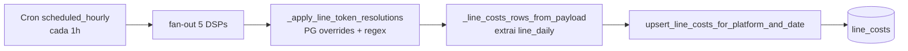
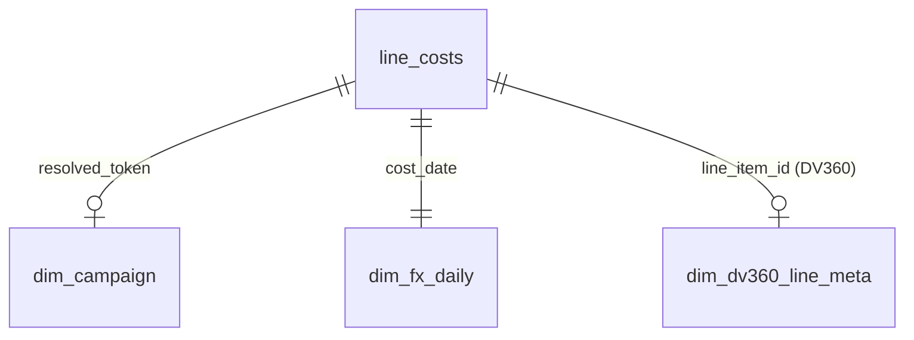

# 📊 `line_costs` — Tabela de Custos por Line

> **Dataset:** `site-hypr.cost_dashboard_rt.line_costs`
> **Tipo:** Fato analítica (particionada + clusterizada)
> **Granularidade:** 1 row por `(cost_date, platform, line)`
> **Quem escreve:** Cron `scheduled_hourly` (a cada 1h)
> **Quem lê:** Dashboard, endpoints `/api/dashboard` e `/api/campaign/<token>`

---

## 🎯 O que é

É a **fonte da verdade** de custos de mídia por DSP. Cada linha representa o gasto de uma *line item* (criativo/lote da campanha) num dia específico, em uma plataforma específica.

Antes existia um blob enorme (`dashboard_snapshots`) que guardava o payload inteiro do dashboard como JSON serializado. Era ruim: cada linha tinha 1–2 MB, impossível de consultar via SQL, e crescia ~5 GB/mês. A `line_costs` substituiu isso completamente — agora cada gasto é uma row tipada com 16 KB no máximo.

---

## 🧱 Esquema completo

| Coluna | Tipo | Obrigatório? | Descrição |
|---|---|---|---|
| `cost_date` | DATE | ✅ | Dia do gasto. **Particiona** a tabela. |
| `platform` | STRING | ✅ | DSP: `DV360`, `Xandr`, `StackAdapt`, `Hivestack`, `Nexd`. **Cluster.** |
| `line_item_id` | STRING | ❌ | ID da line na DSP. NULL pra Hivestack (que não tem ID estável). **Cluster.** |
| `line_name` | STRING | ❌ | Nome completo da line (ex: `ID-LX8VIH_HYPR_PEPSICO-V2_...`). |
| `resolved_token` | STRING | ❌ | Token de 6 caracteres da campanha. Vem de regex no nome OU override manual no PG. **Cluster.** |
| `token_resolution_source` | STRING | ❌ | `name_regex` (extraído do nome) ou `manual_pg` (override). |
| `spend_native_delta` | FLOAT64 | ❌ | Gasto do dia na moeda da DSP. |
| `currency_native` | STRING | ✅ | `USD` ou `BRL`. |
| `spend_brl_delta` | FLOAT64 | ✅ | **Gasto do dia em BRL** (já convertido com PTAX do dia). Use este na maioria das queries. |
| `spend_native_mtd` | FLOAT64 | ✅ | MTD acumulado na moeda nativa. |
| `spend_brl_mtd` | FLOAT64 | ✅ | MTD acumulado em BRL. |
| `exchange_rate_usd_brl` | FLOAT64 | ❌ | PTAX (USD→BRL) usado naquele dia. NULL se moeda nativa = BRL. |
| `had_negative_delta` | BOOL | ✅ | True se a DSP reportou número menor que ontem (raro — geralmente correção retroativa). |
| `observation` | STRING | ❌ | Nota livre (anotação manual via PG, sincronizada). |
| `source_snapshot_at` | TIMESTAMP | ✅ | Quando o snapshot foi tirado. |
| `baseline_snapshot_at` | TIMESTAMP | ❌ | NULL na arquitetura atual (era usado no approach delta antigo). |
| `ingested_at` | TIMESTAMP | ✅ | Quando o load job rodou (auditoria). |
| `is_estimated` | BOOL | ❌ | True pra Hivestack/Nexd (gasto estimado, não medido). |
| `granularity` | STRING | ❌ | `daily` (DV360, Xandr, StackAdapt) ou `monthly_imputed` (Hivestack, Nexd). |

### Partition e cluster

- **`PARTITION BY cost_date`** → queries com filtro `WHERE cost_date BETWEEN X AND Y` só scaneam as partições do range.
- **`CLUSTER BY platform, resolved_token, line_item_id`** → queries com filtros nessas colunas são rápidas mesmo dentro de uma partição.

---

## ⏱ Como é alimentada



A cada 1 hora, o `scheduled_hourly` worker:

1. Chama as 5 DSPs em paralelo
2. Cada DSP retorna um array `line_daily` no shape `[{date, line_item_id, name, spend}, ...]`
3. Resolve tokens via PostgreSQL (overrides manuais) + regex no nome
4. Pra cada `(platform, cost_date)`, faz **DELETE + INSERT** atômico (idempotente)

### Cobertura por DSP

| DSP | Granularidade | Como vem | cost_date alocado |
|---|---|---|---|
| **DV360** | `daily` | Reporting API com `FILTER_DATE` no `groupBy` | dia real do gasto |
| **Xandr** | `daily` | Coluna `day` no relatório CSV | dia real do gasto |
| **StackAdapt** | `daily` | GraphQL `granularity: DAILY` | dia real do gasto |
| **Hivestack** | `monthly_imputed` | Tabela BQ interna (`staging.hivestack_mediacost`) — agregada mensal | `last_day_of_month` |
| **Nexd** | `monthly_imputed` | API REST `/group/campaigns/analytics/summary` (sem breakdown daily real) | `last_day_of_month` |

**Limitações conhecidas:**

- **Hivestack** depende de um pipeline externo que agrega no mês. Pra ter daily real precisaria mudar a fonte (fora do nosso controle).
- **Nexd** retorna *unique impressions in range* da API, com dedup interno. Não dá pra derivar daily real. O total mensal está correto; só não distribui ao longo do mês.

---

## 🔍 Como usar — queries comuns

### Total por DSP no mês

```sql
SELECT
  platform,
  ROUND(SUM(spend_brl_delta), 2) AS total_brl
FROM `site-hypr.cost_dashboard_rt.line_costs`
WHERE cost_date BETWEEN '2026-05-01' AND '2026-05-31'
GROUP BY platform
ORDER BY total_brl DESC;
```

### Top 10 lines mais caras

```sql
SELECT
  platform,
  line_item_id,
  line_name,
  resolved_token,
  ROUND(SUM(spend_brl_delta), 2) AS gasto
FROM `site-hypr.cost_dashboard_rt.line_costs`
WHERE cost_date BETWEEN '2026-05-01' AND '2026-05-31'
GROUP BY platform, line_item_id, line_name, resolved_token
ORDER BY gasto DESC
LIMIT 10;
```

### Gasto diário de uma campanha

```sql
SELECT
  cost_date,
  platform,
  ROUND(SUM(spend_brl_delta), 2) AS gasto
FROM `site-hypr.cost_dashboard_rt.line_costs`
WHERE resolved_token = 'YLYIRS'
GROUP BY cost_date, platform
ORDER BY cost_date, platform;
```

### Lines órfãs (sem token reconhecido)

```sql
SELECT
  platform,
  line_name,
  line_item_id,
  ROUND(SUM(spend_brl_delta), 2) AS gasto
FROM `site-hypr.cost_dashboard_rt.line_costs`
WHERE cost_date BETWEEN '2026-05-01' AND '2026-05-31'
  AND resolved_token IS NULL
GROUP BY platform, line_name, line_item_id
HAVING gasto > 0
ORDER BY gasto DESC;
```

### Custo médio diário do mês

```sql
SELECT
  cost_date,
  ROUND(SUM(spend_brl_delta), 2) AS total_brl
FROM `site-hypr.cost_dashboard_rt.line_costs`
WHERE cost_date BETWEEN '2026-05-01' AND '2026-05-31'
  AND granularity = 'daily'  -- exclui imputed pra ver curva real
GROUP BY cost_date
ORDER BY cost_date;
```

### Auditoria — quando uma row foi ingerida

```sql
SELECT
  ingested_at,
  cost_date,
  platform,
  COUNT(*) AS rows,
  ROUND(SUM(spend_brl_delta), 2) AS total
FROM `site-hypr.cost_dashboard_rt.line_costs`
WHERE cost_date = '2026-05-12'
  AND platform = 'DV360'
GROUP BY ingested_at, cost_date, platform
ORDER BY ingested_at DESC;
```

---

## ⚠️ Coisas importantes pra saber

### 1. `spend_brl_delta` vs `spend_brl_mtd`

- `spend_brl_delta` = gasto **só** do dia (use pra somar períodos)
- `spend_brl_mtd` = MTD acumulado **até aquele dia** (use pra ver o "estado" naquele cost_date)

Pra calcular o total do mês: `SUM(spend_brl_delta)` — **nunca** `SUM(spend_brl_mtd)` (que vai inflar).

### 2. Granularity `monthly_imputed` precisa de filtro especial

Quando você quer **MTD até hoje**, Hivestack/Nexd aparecem no `last_day_of_month`, que é depois de hoje. Pra incluí-los corretamente:

```sql
WHERE (
  (cost_date BETWEEN @period_start AND @period_end
    AND (granularity IS NULL OR granularity = 'daily'))
  OR
  (granularity = 'monthly_imputed'
    AND cost_date BETWEEN @period_start AND LAST_DAY(@period_end, MONTH))
)
```

Isso captura:
- Daily rows até hoje
- Monthly_imputed rows do mês inteiro (mesmo que `cost_date > today`)

### 3. Idempotência

A escrita usa `DELETE FROM line_costs WHERE cost_date=X AND platform=Y` seguido de `INSERT`. Re-rodar o cron com os mesmos dados produz o **mesmo resultado** — não acumula nem duplica.

### 4. Câmbio é histórico

`exchange_rate_usd_brl` é a PTAX **do dia do gasto**, não do dia que o cron rodou. Isso significa que `spend_brl_delta` reflete a conversão correta na época. O blob antigo usava FX único do snapshot — era impreciso historicamente.

### 5. Tokens podem mudar

`resolved_token` é resolvido a cada refresh. Se alguém adicionar override manual no PG, o próximo cron sobrescreve as rows com o novo token. Isso é **intencional** — overrides manuais corrigem retroativamente.

---

## 🔗 Relações com outras tabelas



- **`dim_campaign`**: 1 row por token com cliente/campanha/investido_brl/datas. JOIN por `resolved_token = token`.
- **`dim_fx_daily`**: 1 row por dia com PTAX. JOIN por `cost_date`. (Já está denormalizado em `exchange_rate_usd_brl`, mas dim é a fonte canônica.)
- **`dim_dv360_line_meta`**: 1 row por DV360 `line_item_id` com advertiser/IO/campaign/partner. JOIN só pra DV360.

---

## 📈 Estatísticas atuais

| Métrica | Valor |
|---|---|
| Rows | ~78k |
| Storage | 16 MB |
| Crescimento | ~250 rows/dia |
| Custo storage | $0 (free tier 10 GB) |
| Custo query típico | < $0.001 (~5 MB scaneado) |

---

## 🚨 Troubleshooting

### "Vejo um valor diferente do dashboard antigo"

Provável **diferença de FX**. O dashboard antigo usava FX único do snapshot; `line_costs` usa PTAX por dia. Pra DSPs em USD (DV360, Xandr antigamente), pode dar 5–10% de diferença em meses voláteis.

### "Falta dado de uma DSP em algum dia"

Verifica `dashboard_refresh_runs` pra ver se o cron daquele horário deu erro:

```sql
SELECT started_at, finished_at, status, error_message
FROM `site-hypr.cost_dashboard_rt.dashboard_refresh_runs`
WHERE DATE(started_at) = '2026-05-12'
ORDER BY started_at DESC;
```

### "Total do mês passado mudou retroativamente"

DSPs podem corrigir relatório retroativamente (final de mês, ajustes de billing). Como o cron sobrescreve a partição inteira, o último cron do dia tem o número final.

---

## 🛠 Backfill (one-shot, raro)

Se precisar repopular um período inteiro (deploy errado, mudança de schema, etc.):

```bash
.venv/bin/python -m backend.scripts.backfill_line_costs_2026 \
  --start 2026-01-01 \
  --end 2026-05-12
```

⚠️ Faz **1 chamada de API por mês por DSP** (~25 calls totais pra 5 meses, ~15 min de execução). Idempotente — pode rodar várias vezes sem efeito colateral.

---

## 📚 Onde está o código

| Arquivo | Função |
|---|---|
| `backend/bigquery_store.py` | `_ensure_line_costs_table`, `upsert_line_costs_for_platform_and_date` |
| `backend/dashboard_service.py` | `_line_costs_rows_from_payload` (transform), hook no `_refresh_dashboard` |
| `backend/bigquery_reads.py` | Todas as queries de leitura usadas pelo dashboard |
| `src/apis/{dv360,xandr,stackadapt,hivestack,nexd}.py` | Cada integração emite `line_daily` no shape esperado |
| `backend/scripts/backfill_line_costs_2026.py` | Script de backfill one-shot |
